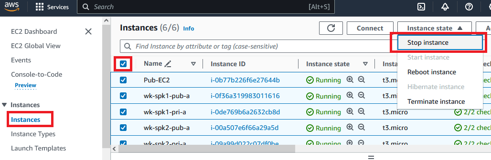
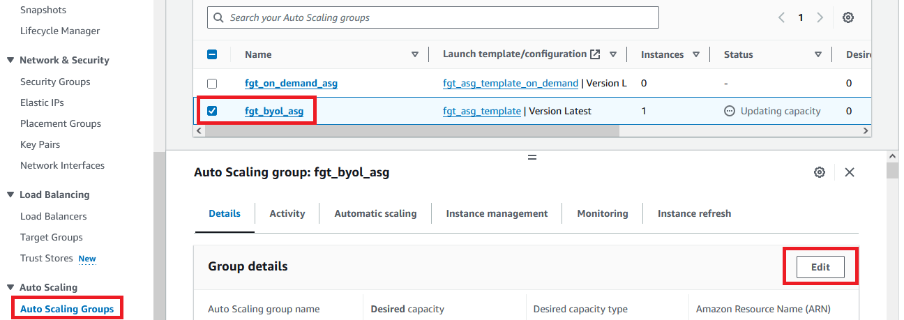
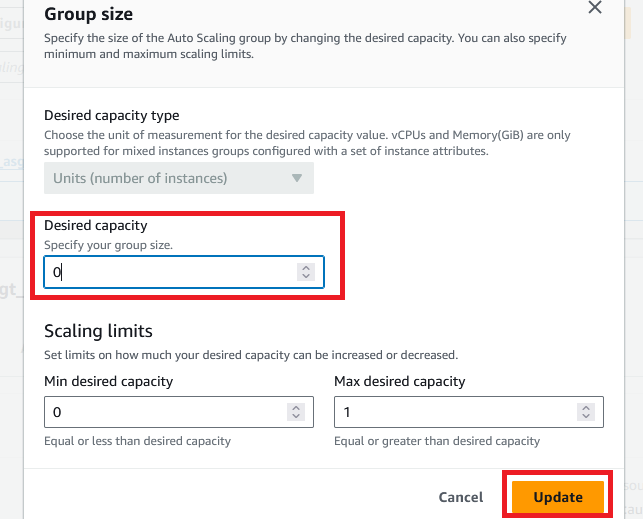

I hope this walkthrough demo helped you in someway.

We are all responsible for saving money for the company, so please, before you go stop all the EC2 and set FortiGate ASG to 0.

### Stopping EC2
1. Open AWS Console
2. Go to EC2 > Instances
3. Check all the Instances and in "instance state" click "Stop instance"

### FortiGate ASG to 0
1. If you only stop the FortiGate instance the auto scaling group will start a new instance, so you need to change it as well
2. In EC2 > scroll down to "Auto Scaling Groups" menu
3. Select "fgt_byol_asg" and click "Edit"

4. Set "Desired capacity" to 0 and click "Update"

Now you are good to go! CSE Americas International Team thanks you for your time!