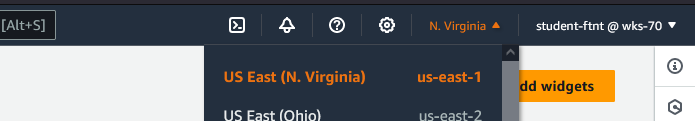
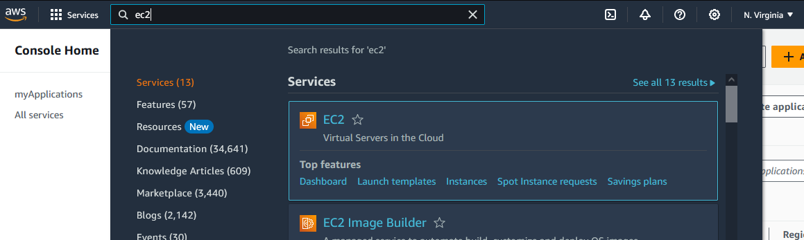
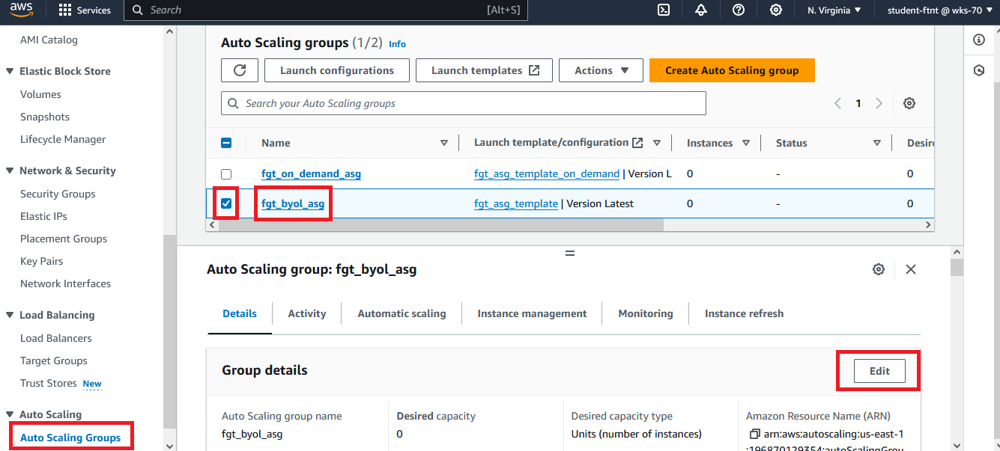
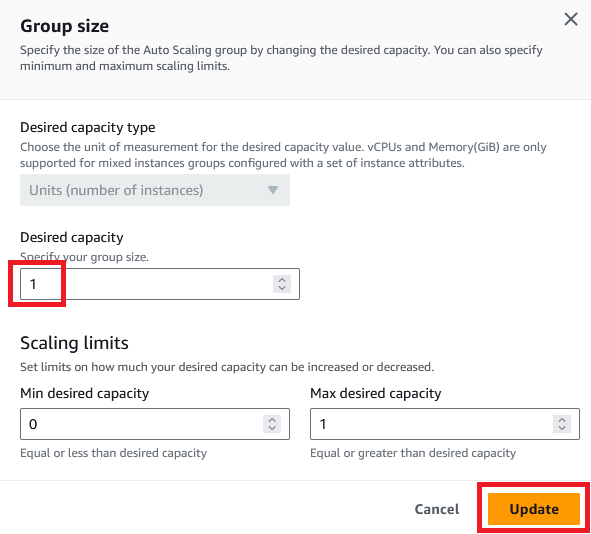
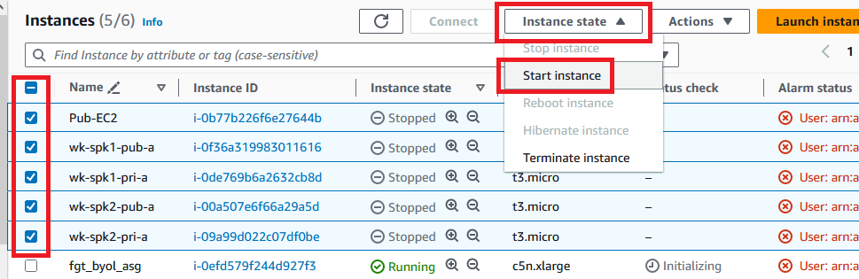

Every night (GMT-3 timezone) the EC2 instances are shutdown to save money and the FortiGate ASGs are set to zero, so if you enter in the AWS account is probably that there is somebody else using it, *because I doubt somebody used the environment and forgot to shutdown, right?* :D

So, the first thing you will need to do, after logged into AWS account, is:

### Bring FortiGate VM up
1. Make sure you are in N. Virginia region

2. Type EC2 in search box and click on it

3. Scroll down to "Auto Scaling Groups" menu. Click on it and select the "fgt_byol_asg"
4. Click "Edit"

5. Set "Desired Capacity" at 1 and click "Update"

6. With this only one FortiGate instance will be created. This is enough for the demo, in the real environment, it is recommended to have one per AZ used.
7. Go to "Instances" menu. You will see a FortiGate instance running (wait 3-5 minutes before accessing it). In this process the FortiGate is being licensed using [FortiFlex](https://www.fortinet.com/products/fortiflex)  
8. In the same page, start the other instances. To do so, check all of them, click "Instance state" button and click on "Start instance"

9. Now you are good to start the tasks