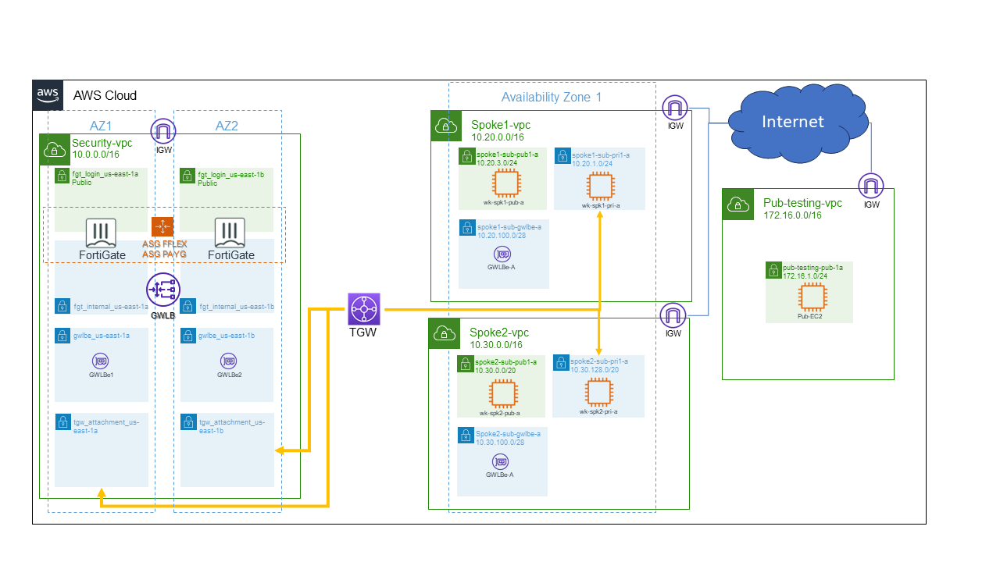

Remembering AWS diagram:

In this demo, all these components are already setup. 

We have:
* FortiGate VM in two auto-scale groups: ASG FFlex (fgt_byol_asg: using FortiFlex licenses) and ASG PAYG (fgt_on_demand_asg: using PAYG FortiGate VMs)
* Routing is configured for 2 AZs (availability zones) but we will use only us-east-1a
* There are EC2 instances in every subnet that you will use
* The VPC **Pub-testing-vpc** is **not** connected with the other VPCs. You will use the EC2 hosted there to run attacks. It simulates an attack coming from internet

This deployment has 2 auto scaling groups, as mentioned before. The reason for that is to give flexibility to the customer, who can use the BYOL group (with FortiFlex licenses) to support the "standard daily network traffic" and the PAYG only for peak moments, where the customer will be charged only for the hours used.

Talking about flexibility, FortiFlex is great when the customer wants to have more options about licensing, please check out [this website](https://www.fortinet.com/products/fortiflex)
