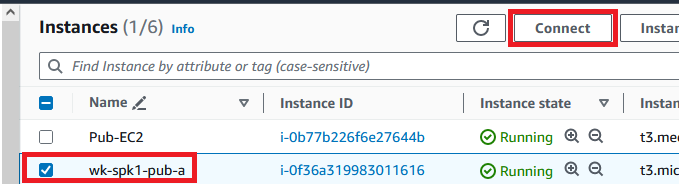
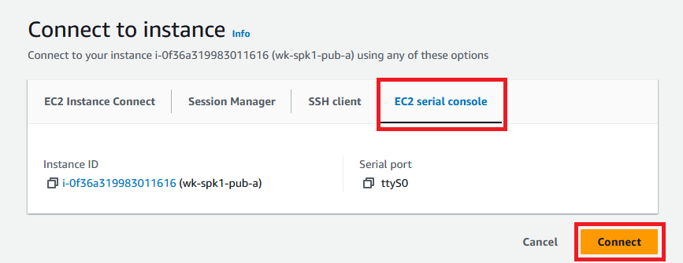
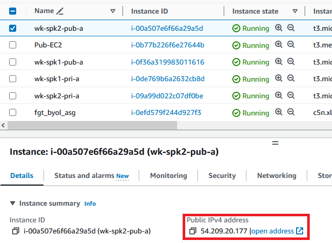
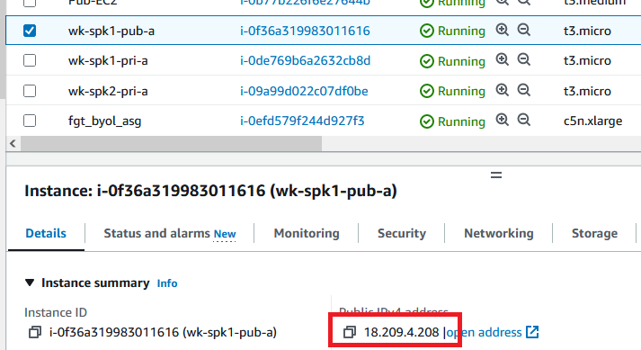
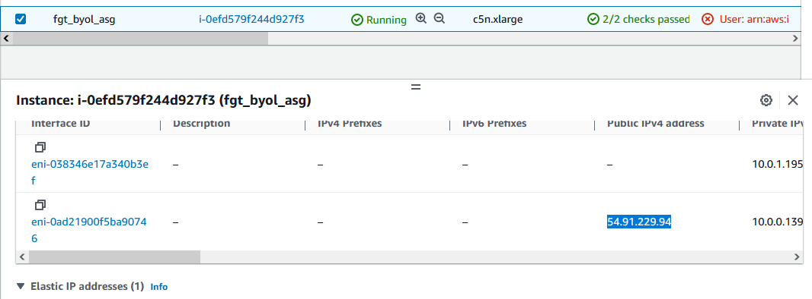
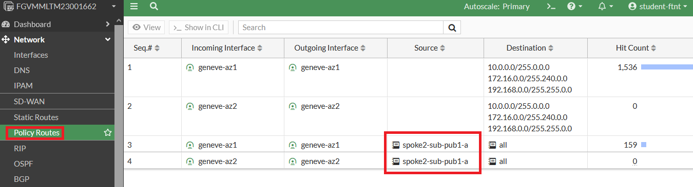
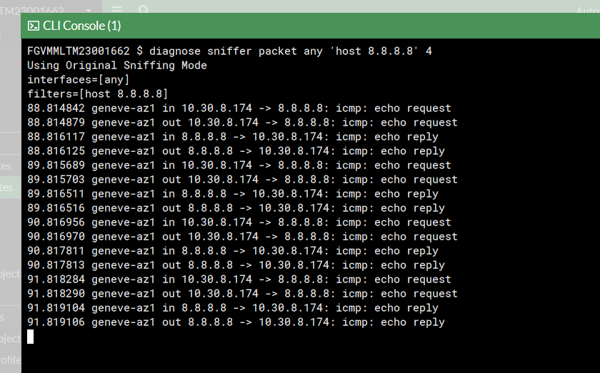
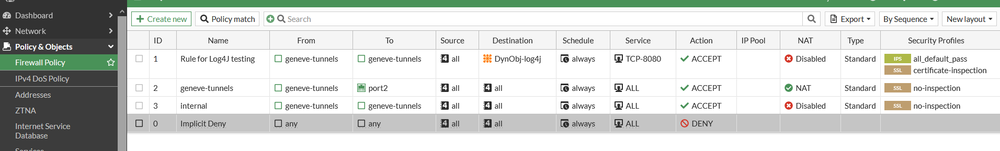

When using FortiGate with GWLB you can save money and not using [NAT Gateways](https://docs.aws.amazon.com/vpc/latest/userguide/vpc-nat-gateway.html). NAT GW's are charge for hour and usage, with the scenario you have here, the FortiGate can be your NAT Gateway for all the VPCs connected.

NAT Gateways are used by private instances, what I mean is, the instances that don't have public IPs. Instances that have public IP use IGW (Internet Gateway) to go to internet.

In this first lab, we will see an instance with public IP going to internet using FortiGate public IP and other instance going with its own IP, but with the traffic being inspected by FortiGate.

1. In AWS console, go to EC2 menu and click on "Instances"
2. Click "wk-spk1-pub-a" and then click "Connect"

3. Click "EC2 serial console" and then "Connect"

4. The login information is:

user: **`student`**
password: **`F0rt1n3t`**

5. Leave this console tab opened. Repeat the same process with the instance "wk-spk2-pub-a"

6. In both consoles run the command:

**`curl icanhazip.com`**

7. This command let us know with which public IP this instance is accessing internet. You will see that the IP is different between **wk-spk2-pub-a** and **wk-spk1-pub-a**. This is happening because one instance (**wk-spk2-pub-a**) is going to the internet using its own public IP and the other instance is using FortiGate's IP.

8. Leave these console tabs opened
9. Go back to AWS console and check the public IPs:

10. Check the FortiGate. To see the FortiGate public IP, select the FortiGate, then click "Networking" tab and scroll down:

11. Copy this IP and in a new browser tab, paste it to access FortiGate GUI. 
12. FortiGate credentials are in Sharepoint page
13. After you logged into FortiGate, check the "Policy Routes". You will see we have a policy route for all **"spoke2-sub-pub1-a"** subnet, that is the subnet from **wk-spk2-pub-a**

14. You can run a sniffer to see the traffic from both instances (**wk-spk2-pub-a** and **wk-spk1-pub-a**) being inspect by FortiGate. Open the FortiGate CLI Console and paste the command below:

**`diag sniffer packet any 'host 8.8.8.8' 4`**

15. Leave it running and go to the console tab of one EC2 instance. Then type:

**`ping 8.8.8.8`**

16. Go back to FortiGate and see it in the console

17. Go back to the same EC2 instance console and stop the ping command.
18. Repeat the ping command in the other EC2 instance console. You will see FortiGate is inspecting it as well.
19. You are free to change FortiGate firewall policy to perform some different tests

{}
**If you change FortiGate firewall policy, remember to leave it as it was when you accessed or your next labs may not work**
{}

This is FortiGate security policy default:

