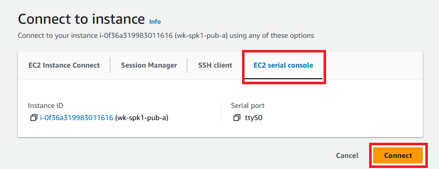
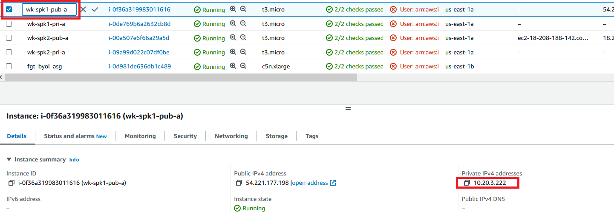
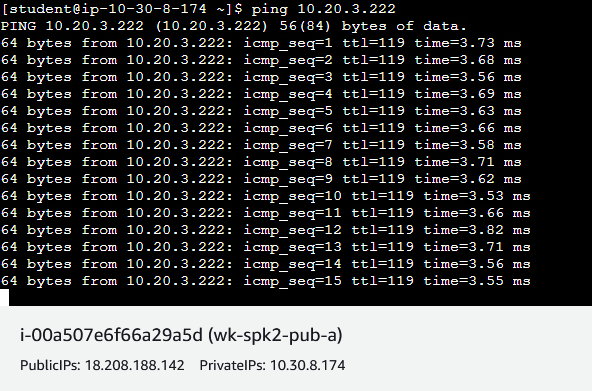
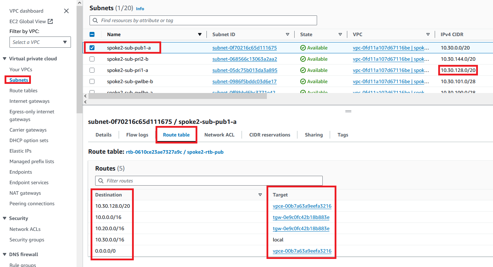

With the same FortiGate cluster, you can inspect the traffic between VPCs and subnets inside the same VPC.

In this task you will test both scenarios.

### Traffic inspection between VPCs

1. In AWS console, go to EC2 menu and click on "Instances"
2. Click "wk-spk1-pub-a" and then click "Connect"

3. Click "EC2 serial console" and then "Connect"

4. The login information is:
user: **`student`**
password: **`F0rt1n3t`**

5. Leave this console tab opened. Repeat the same process with the instance ***"wk-spk2-pub-a"***

6. Using the console, ping one instance from another. Example: go to ***"wk-spk2-pub-a"*** console and ping ***"wk-spk1-pub-a"*** internal IP

7. To see the internal IP from an EC2, go to AWS console > EC2 > Instances and select the instance. You will see the IP in the panel below

8. Leave ping running and connect to FortiGate VM

9. Check the FortiGate. To see the FortiGate public IP, select the FortiGate, then click "Networking" tab and scroll down:

10. Copy this IP and in a new browser tab, paste it to access FortiGate GUI. 
11. FortiGate credentials are in Sharepoint page
12. After you logged into FortiGate, go to "Policy & Objects" > "Firewall Policy". You will see a rule allowing all the traffic from "geneve-tunnels" to "geneve-tunnels". It means, all traffic flowing through the tunnels created when GWLB was deployed is allowed.

13. Now, change the status of this rule to disable. You will see the ping in ***"wk-spk2-pub-a"*** console will stop working.

14. You can always check if the traffic is coming to FortiGate using CLI and the command below (replace X.X.X.X with the IP you want to monitor):

**`diag sniffer packet any 'host X.X.X.X' 4`**

15. Re-enable the firewall policy

### Traffic inspection between subnets
In previous task you saw that FortiGate is inspecting the traffic between VPCs, but in some cases you want to inspect or restrict the traffic between subnets in the same VPC. For example: a subnet contains data information (eg. database) and the other subnet the application. You want the application subnet access the data, but not the other way around.

To make it works, you will need to redirect the traffic to be inspected by FortiGate. To do so, you must use the route tables, where you point the destination as the subnet and the target as the GWLB Endpoint, that will forward the traffic to GWLB, then GWLB will forward the traffic to one FortiGate, where the traffic will be inspected and if it's allowed, it will return to the same path.

In this demo, we configured **spoke2-vpc** to have inter-vpc traffic inspected. Let's see how it was configured.

1. In AWS console, go to VPC (use the search bar)
2. Go to Subnets menu and select ***"spoke2-sub-pub1-a"***. This is the subnet where ***"wk-spk2-pub-a"*** is hosted.
3. Click "Route table". It will load the route table for this subnet. You can see the destination CIDR's and the Target. Note there is a destination as ***10.30.128.0/20*** that is the CIDR from ***"spoke2-sub-pri1-a"*** pointing to vpce-xxxxxxx, this is the GWLB Endpoint. So when this subnet access the ***"spoke2-sub-pri1-a"*** the traffic will be inspected by FortiGate.

4. Now, go to EC2 menu and click on "Instances"
5. Click "wk-spk2-pri-a" and copy its private IP

5. Click "wk-spk2-pub-a"and then click "Connect"
6. Click "EC2 serial console" and then "Connect"
7. The login information is:

user: **`student`**
password: **`F0rt1n3t`**

8. Ping the IP copied from **step 5**

9. Check the FortiGate. To see the FortiGate public IP, select the FortiGate, then click "Networking" tab and scroll down:

10. Copy this IP and in a new browser tab, paste it to access FortiGate GUI. 
11. FortiGate credentials are in Sharepoint page
12. After you logged into FortiGate, go to "Policy & Objects" > "Firewall Policy". You will see a rule allowing all the traffic from "geneve-tunnels" to "geneve-tunnels". It means, all traffic flowing through the tunnels created when GWLB was deployed is allowed.

13. Now, change the status of this rule to disable. You will see the ping in ***"wk-spk2-pub-a"*** console will stop working.

14. You can always check if the traffic is coming to FortiGate using CLI and the command below (replace X.X.X.X with the IP you want to monitor):

**`diag sniffer packet any 'host X.X.X.X' 4`**

15. You can create and modify FortiGate firewall rules, so try to block ping, or some service, etc. This was only to demo the traffic being inspected and to make it simple, we enabled/disabled rules, but you can implement more sophisticated rules with this same principle.
16. Re-enable the firewall policy and return FortiGate rules to original state

