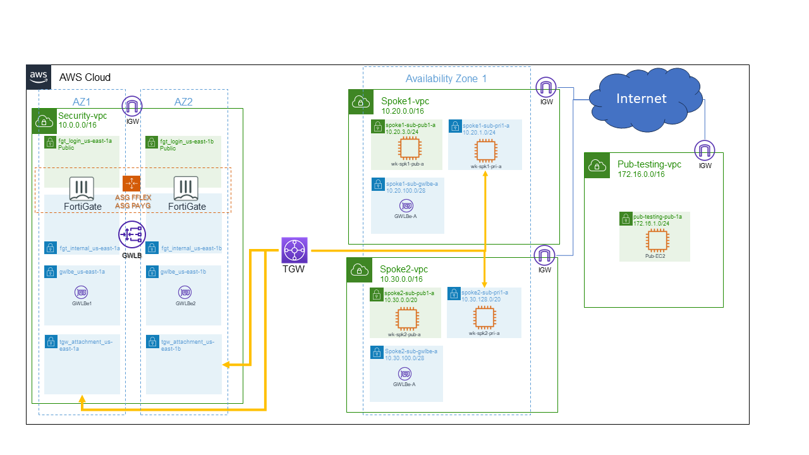

## FortiGate auto-scale on AWS walk-through demo

Here you will find information on how to use an environment already provisioned to demo or just to see how FortiGate VM can be configured and used for North-South and East-West inspection on AWS with gateway load balancer.

In this environment you will be able to:
* View and change some FortiGate policies
* Access AWS console with read-only user
* Access EC2 to test network connectivity and inspection
* Check how FortiGate, GWLB, TGW and route tables are configured to make it work
* and other labs available on the left menu

This is the topology you will find:

Let's begin!

